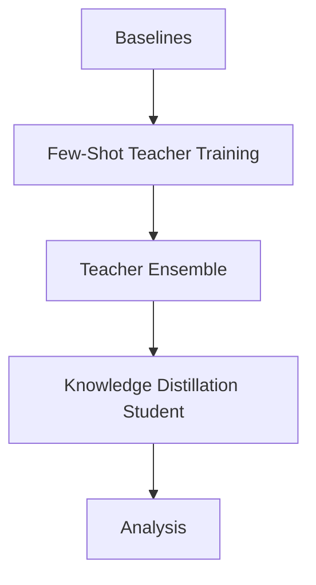

# Few-Shot Ensemble and Knowledge Distillation Language Processing

## System Requirements
- **Python 3.8+**
- **Hardware Acceleration Supports**: **CUDA** (NVIDIA), **MPS** (Apple Silicon), and **CPU**.
- The code automatically detects the best available hardware using the `get_device()` utility.

## Install libraries
Run `pip install -r src/requirements.txt` from the core directory to install necessary libraries.

## Pipeline Overview
The repository implements the following experimental pipeline:

Note:
The pipeline supports modularity. Student distillation can be performed:
- From a precomputed ensemble
- Directly from multiple teacher runs

All stages store artifacts in the `runs/` directory for reproducibility and analysis.

## Methods

### Seeds
The code uses following types of seeds: 
-  --support_seed: support seed `sample_few_shot_support_set` in `utils.py` uses `np.random.seed(seed)` and samples `n_per_class` examples per class 
- --train_seed: training seed `set_seed()` in `utils.py` controls PyTorch randomness, model weight initialization and dataloader shuffling

### Train/test split
The code utilizes the standard AG News partition from HuggingFace which consists of 120,000 training and 7,600 test samples.

For few-shot:
- A support set of size `4 × n_per_class` is sampled
- Remaining training data is not used
- Evaluation is always done on the full test set

Important:
The support set sampling must be identical across teachers, ensemble, and student.
This requires:
- same `--support_seed`
- same `--n_per_class`

Additionally, ordering must match exactly, where the n-th sample in the student support set must correspond to the n-th teacher probability vector, otherwise distillation will fail.

---

## Run Model Training `training.py`

### Modes

The script supports two modes:

1. Baseline:
--mode baseline

2. Teachers:
--mode teachers

---

### Structure

python training.py \
  --mode < baseline|teachers > \
  --model < hf_model_name > \
  --models < hf_model_name1 > < hf_model_name2 > ... \
  --train_seed < train_seed:int > \
  --train_seeds < seed1:int > < seed2:int > ... \
  --support_seed < support_seed:int > \
  --n_per_class < n_per_class:int > \
  --epochs < epochs:int > \
  --lr < lr:float > \
  --batch_size < batch_size:int > \
  --max_len < max_len:int > \
  --out_dir < runs_dir > \
  --max_steps < max_steps:int > \
  --grad_accum_steps < grad_accum_steps:int > \
  --log_every < log_every:int >

Use only one of the following:

`--model ...`

OR

`--models ...`

---

### Example (full dataset baseline):

python training.py \
  --mode baseline \
  --model distilbert-base-uncased \
  --train_seed 0 \
  --epochs 2 \
  --lr 2e-5 \
  --batch_size 16 \
  --max_len 128

---

### Example (zero-shot baseline):

python training.py \
  --mode baseline \
  --model distilbert-base-uncased \
  --train_seed 0 \
  --epochs 0 \
  --lr 2e-5 \
  --batch_size 16 \
  --max_len 128

---

### Example (few-shot baseline with single teacher):

python training.py \
  --mode baseline \
  --model distilbert-base-uncased \
  --train_seed 0 \
  --n_per_class 10 \
  --support_seed 123 \
  --epochs 50 \
  --lr 2e-5 \
  --batch_size 8 \
  --max_len 128

---

### Example (few-shot with multiple teachers):

python training.py \
  --mode teachers \
  --support_seed 123 \
  --n_per_class 10 \
  --train_seeds 0 1 2 \
  --models bert-base-uncased distilbert-base-uncased t5-small

---

### Parameters

- `--mode <baseline|teachers>`: Selects the training mode.
- `--model <hf_model_name>`: HuggingFace model name for baseline mode.
- `--models <hf_model_name1> <hf_model_name2> ...`: HuggingFace model names for teachers mode.
- `--train_seed <train_seed:int>`: Random seed for one baseline run.
- `--train_seeds <seed1:int> <seed2:int> ...`: Random seeds for multiple teacher runs.
- `--support_seed <support_seed:int>`: Seed used to sample the few-shot support set.
- `--n_per_class <n_per_class:int>`: Number of training samples per class. Enables few-shot training.
- `--epochs <epochs:int>`: Number of training epochs.
- `--lr <lr:float>`: Learning rate.
- `--batch_size <batch_size:int>`: Batch size.
- `--max_len <max_len:int>`: Maximum token length.
- `--out_dir <runs_dir>`: Directory where run outputs are saved.
- `--max_steps <max_steps:int>`: Optional early stopping/debugging limit. Use `-1` for no limit.
- `--grad_accum_steps <grad_accum_steps:int>`: Number of gradient accumulation steps.
- `--log_every <log_every:int>`: Print training loss every N steps.

---

### Notes

- In `baseline` mode, if `--n_per_class` is not provided, the model is trained on the full AG News training set.
- In `baseline` mode, if `--n_per_class` is provided, the model is trained on a few-shot support set.
- In `teachers` mode, `--n_per_class` is required.
- Teacher runs save support-set predictions, which are later used by `ensemble.py` and `student.py`.
- Use the same `--support_seed` and `--n_per_class` across teachers, ensemble, and student runs.

---

## Run Ensemble `ensemble.py`
### Structure
python ensemble.py \
  --teacher_dirs runs/< teacher_run_dir1 > runs/< teacher_run_dir2 > ... \
  --name < ensemble_run_name > \
  --out_dir < runs_dir > \
  --also_support

### Example
python ensemble.py \
  --teacher_dirs runs/teacher_bert-base-uncased_fs10_supp123_seed0 \
                 runs/teacher_distilbert-base-uncased_fs10_supp123_seed0 \
                 runs/teacher_t5-small_fs10_supp123_seed0 \
  --name ensemble_fs10_supp123_seed0 \
  --also_support

### Parameters
- `--teacher_dirs`: teacher run folders
- `--name`: output name
- `--also_support`: required for KD as adds < support_probs.npy >

Note on latency:
Ensemble latency is computed as the sum of teacher latencies (sequential inference).

---

## Train Student `student.py`

### Modes

Student supports two modes:

1. From ensemble:
--ensemble_dir runs/<ensemble_run_dir>

2. From teacher runs:
--teacher_dirs runs/<teacher1> runs/<teacher2> ...

---

### Structure
python student.py \
  --student_model < hf_model_name > \
  --support_seed < support_seed:int > \
  --n_per_class < n_per_class:int > \
  --train_seed < train_seed:int > \
  --epochs < epochs:int > \
  --lr < lr:float > \
  --batch_size < batch_size:int > \
  --max_len < max_len:int > \
  --tau < temperature:float > \
  --alpha < alpha:float > \
  --out_dir < runs_dir > \
  --ensemble_dir runs/< ensemble_run_dir >
  --teacher_dirs runs/< teacher_run_dir1 > runs/< teacher_run_dir2 > ...

Use only one of the following:

`--ensemble_dir ...`

OR

`--teacher_dirs ...`

---

### Example (ensemble):
python student.py --student_model distilbert-base-uncased \
  --support_seed 123 --n_per_class 10 --train_seed 0 \
  --ensemble_dir runs/ensemble_fs10_supp123_seed0 \
  --tau 2.0 --alpha 0.1

### Example (teachers):
python student.py --student_model distilbert-base-uncased \
  --support_seed 123 --n_per_class 10 --train_seed 0 \
  --teacher_dirs runs/teacher_bert runs/teacher_distilbert \
  --tau 2.0 --alpha 0.1

---

### Parameters

- `--student_model <hf_model_name>`: HuggingFace model architecture used as the student.
- `--support_seed <support_seed:int>`: Must match the teacher/ensemble support seed.
- `--n_per_class <n_per_class:int>`: Must match the teacher/ensemble few-shot size.
- `--train_seed <train_seed:int>`: Random seed for student model initialization and training.
- `--epochs <epochs:int>`: Number of student training epochs.
- `--lr <lr:float>`: Student learning rate.
- `--batch_size <batch_size:int>`: Student training batch size.
- `--max_len <max_len:int>`: Maximum token length.
- `--tau <temperature:float>`: Distillation temperature.
- `--alpha <alpha:float>`: Weight between hard-label CE loss and soft-target KD loss.
- `--out_dir <runs_dir>`: Directory where the student run is saved.
- `--ensemble_dir runs/<ensemble_run_dir>`: Path to a stored ensemble folder containing `support_probs.npy`.
- `--teacher_dirs runs/<teacher_run_dir...>`: One or more teacher folders containing `support_probs.npy`.

---

## Run Comparison Analysis `compare.py`
python compare.py --runs_root runs --out runs/comparison.csv --out_summary runs/comparison_summary.csv

- Aggregates metrics
- Computes mean/std
- Computes retained accuracy
- Generates plots

---

## Quick Start

Example pipeline using 10 samples per class:

### Train teachers
python training.py \
  --mode teachers \
  --support_seed 123 \
  --n_per_class 10
  --models bert-base-uncased distilbert-base-uncased t5-small

### Build ensemble
python ensemble.py \
  --teacher_dirs runs/... runs/... \
  --name ensemble_fs10_supp123 \
  --also_support

### Train student
python student.py \
  --student_model distilbert-base-uncased \
  --support_seed 123 \
  --n_per_class 10 \
  --ensemble_dir runs/ensemble_fs10_supp123 \
  --tau 2.0 --alpha 0.3

---

## Default Parameters

| Parameter | Default |
|----------|--------|
| epochs | 5 |
| lr | 2e-5 |
| batch_size | 8 |
| max_len | 128 |
