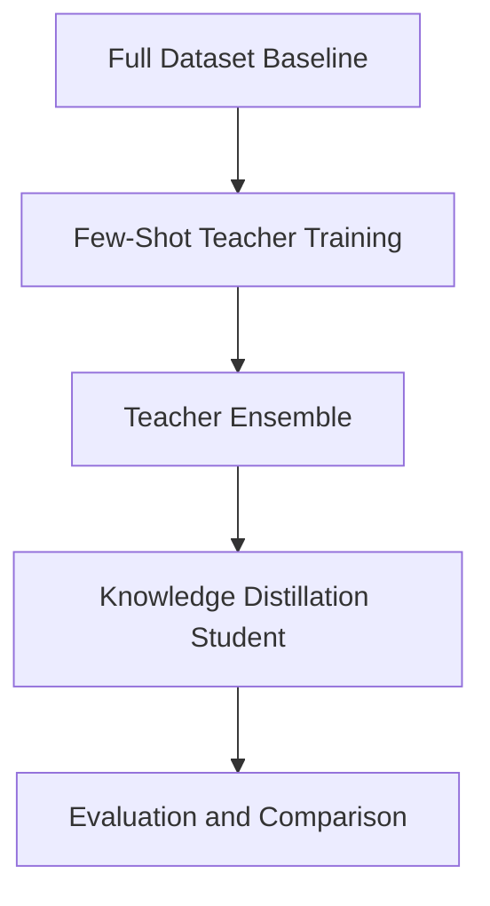

# Few-Shot Ensemble and Knowledge Distillation Language Processing

## System Requirements
- **Python 3.8+**
- **Hardware Acceleration Supports**: **CUDA** (NVIDIA), **MPS** (Apple Silicon), and **CPU**.
- The code automatically detects the best available hardware using the `get_device()` utility.

## Install libraries
Run `pip install -r src/requirements.txt` from the core directory to install necessary libraries.

## Pipeline Overview
The repository implements the following experimental pipeline:

All stages store artifacts in the `runs/` directory for reproducibility and later analysis.

## Methods
### Seeds
The code uses following types of seeds: 
-  --support_seed: support seed `sample_few_shot_support_set` in `utils.py` uses `np.random.seed(seed)` and samples `n_per_class` examples per class 
- --train_seed: training seed `set_seed()` in `utils.py` controls PyTorch randomness, model weight initialization and dataloader shuffling, and is used in `run_teachers.py`, `run_students.py` and `run_full_dataset_train.py`

### Train/test split
The code utilizes the standard AG News partition from HuggingFace which consists of 120,000 training and 7,600 test samples (approximately 93%/7% split).

However, to simulate a few-shot environment, code takes random sampling from the training partition to create a 'Support Set' of only `N` samples per class. Total support size: `4 × n_per_class`. The remaining ~119,900+ samples in the training pool are discarded, and the model is evaluated against the full 7,600-sample test set. 

## Run model trainings `training.py`

python training.py

### Modes
The script supports two modes:
- baseline - trains a single model (full dataset or few-shot subset).
- teachers - trains multiple teacher models and saves predictions for ensemble and knowledge distillation.

### Baseline
You can train a single model either on the full dataset or on a few-shot subset.

#### Single Model Example:
python training.py \
  --mode baseline \
  --model <hf_model_name> \
  --train_seed <seed:int> \
  --epochs <epochs:int> \
  --lr <lr:float> \
  --batch_size <batch_size:int> \
  --max_len <max_len:int> \
  --out_dir <runs_dir>

##### Parameters
- `--mode baseline`: Run single-model training.
- `--model <hf_model_name>`: HuggingFace model name (e.g. `bert-base-uncased`, `distilbert-base-uncased`, `t5-small`).
- `--train_seed <seed:int>`: Random seed for model initialization and training.
- `--epochs <epochs:int>`: Number of training epochs.
- `--lr <lr:float>`: learning rate.
- `--batch_size <batch_size:int>`: Batch size.
- `--max_len <max_len:int>`: Max token length.
- `--out_dir <runs_dir>`: Path to save results.

###### Optional Parameters:
- `--n_per_class <int>`: Number of samples per class used for training. **Enables few-shot training.**
- `--support_seed <int>`: Random seed used to sample the few-shot support set.
- `--max_steps <int>`: Early stopping (debugging; -1 = no limit).
- `--grad_accum_steps <int>`: Gradient accumulation steps.
- `--log_every <int>`: Print training loss every N steps (debugging).

#### Full Dataset Example:
python training.py \
  --mode baseline \
  --model distilbert-base-uncased \
  --train_seed 0 \
  --epochs 2 \
  --lr 2e-5 \
  --batch_size 16 \
  --max_len 128

#### Few-Shot Baseline Example: 
Train a single model on 10 samples per class (4 classes, so 10*4 = 40 total samples).
python training.py \
  --mode baseline \
  --model distilbert-base-uncased \
  --train_seed 0 \
  --n_per_class 10 \
  --support_seed 123 \
  --epochs 50 \
  --lr 2e-5 \
  --batch_size 8 \
  --max_len 128

### Teachers
You can train multiple teacher models on a **few-shot support set** and save their predictions for ensemble learning and knowledge distillation.

python training.py \
  --mode teachers \
  --support_seed <support_seed:int> \
  --n_per_class <n_per_class:int> \
  --train_seeds <seed1:int> <seed2:int> ... \
  --models <hf_model_name1> <hf_model_name2> ...

#### Parameters
- `-mode teachers`: Run teacher training mode.
- `--support_seed <support_seed:int>`: Random seed used to sample the few-shot support set.
- `--n_per_class <n_per_class:int>`: Number of samples per class used for training.
- `--train_seeds <seed>`: Random seed for model initialization and training
- `--models <hf_model_name>`: HuggingFace model name (e.g. `bert-base-uncased`, `distilbert-base-uncased`, `t5-small`).

#### Example:
python training.py \
  --mode teachers \
  --support_seed 123 \
  --n_per_class 10 \
  --train_seeds 0 1 2 \
  --models bert-base-uncased distilbert-base-uncased t5-small

With the following defaults:
epochs = 5
learning_rate = 2e-5
batch_size = 8
max_len = 128

## Run Ensemble baseline `ensemble.py`

python ensemble.py --teacher_dirs runs/<"teacher_run_dir1"> runs/<"teacher_run_dir2"> ... --name <"ensemble_run_name"> --also_support

### Parameters
- `--teacher_dirs runs/<teacher_run_dir...>`: list of teacher run folders to ensemble (must all share the same support/test ordering).
- `--name <ensemble_run_name>`: name of the ensemble run folder to create under `runs/`.
- `--also_support`: also store `support_probs.npy` for KD training

### Example:
python ensemble.py \
  --teacher_dirs runs/teacher_bert-base-uncased_fs10_supp123_seed0 \
               runs/teacher_distilbert-base-uncased_fs10_supp123_seed0 \
               runs/teacher_t5-small_fs10_supp123_seed0 \
  --name ensemble_fs10_supp123_seed0 \
  --also_support

Output (under `runs/ensemble_fs10_supp123_seed0/`):
- `support_probs.npy` (only if `--also_support`)
- `test_probs.npy`
- `support_labels.npy` / `test_labels.npy`
- `meta.json`

---

## Train Ensemble-Distilled Student `student.py`

python student.py --student_model <"hf_model_path:str"> \
  --support_seed <"support_seed:int"> --n_per_class <"n_per_class:int"> --train_seed <"train_seed:int"> \
  --ensemble_dir runs/<"ensemble_run_dir"> \
  --tau <"temperature:float"> --alpha <"alpha:float">

### Parameters
- `--student_model <hf_model_path:str>`: the model architecture to train (e.g., distilbert-base-uncased).
- `--support_seed <support_seed:int>`: must match the teachers/ensemble.
- `--n_per_class <n_per_class:int>`: must match the teachers/ensemble.
- `--train_seed <train_seed:int>`: seed for student training.
- `--ensemble_dir runs/<ensemble_run_dir>`: path to stored ensemble folder containing `support_probs.npy` (created by `ensemble.py --also_support`).
- `--tau <temperature:float>`: distillation temperature (applied to probability distributions).
- `--alpha <alpha:float>`: CE vs KD weighting. Loss = `alpha*CE + (1-alpha)*tau^2*KD`.

### Example:
python student.py --student_model distilbert-base-uncased \
  --support_seed 123 --n_per_class 10 --train_seed 0 \
  --ensemble_dir runs/ensemble_fs10_supp123_seed0 \
  --tau 2.0 --alpha 0.1

Output (per run folder under `runs/`):
- `test_logits.npy`, `test_probs.npy`, `test_labels.npy`
- `meta.json`

---

## Ensemble efficiency benchmark `ensemble_cost.py`

Unlike `cost_analysis.py` which benchmarks a single model, this script measures the combined footprint of the heterogeneous ensemble.

python ensemble_cost.py --models <"model1"> <"model2"> <"model3"> --out runs/eff_ensemble.json

### Parameters
- `--models`: List of HuggingFace model names (e.g., `bert-base-uncased distilbert-base-uncased t5-small`).
- `--out`: Path to save the combined efficiency metrics.

### Example:
python ensemble_cost.py --models bert-base-uncased distilbert-base-uncased t5-small --out runs/eff_ensemble.json

---

## Variance across multiple runs evaluation `evaluation.py`

python evaluation.py --run <"run_prefix">

### Parameters
- `--run <run_prefix>`: prefix used to match multiple run folders under `runs/`.
  For example:
  - `teacher_bert-base-uncased_fs10_supp123`
  - `teacher_distilbert-base-uncased_fs10_supp123`
  - `teacher_t5-small_fs10_supp123`
  - `student_distilbert-base-uncased_fs10_supp123`
  - `ensemble_fs10_supp123`

### Example:
python evaluation.py --run teacher_bert-base-uncased_fs10_supp123
python evaluation.py --run teacher_distilbert-base-uncased_fs10_supp123
python evaluation.py --run teacher_t5-small_fs10_supp123
python evaluation.py --run student_distilbert-base-uncased_fs10_supp123
python evaluation.py --run ensemble_fs10_supp123

Output:
- `runs/summary_<run_prefix>.json`

---

## To run efficiency benchmark `cost_analysis.py`

python cost_analysis.py --model_name <hf_model_name> --out runs/eff_<model_tag>.json

### Parameters
- `--model_name <hf_model_name>`: HuggingFace model name to benchmark (e.g. `bert-base-uncased`).
- `--out runs/eff_<model_tag>.json`: output JSON path (convention: `eff_<something>.json`).

### Example:
python cost_analysis.py --model_name bert-base-uncased --out runs/eff_bert.json
python cost_analysis.py --model_name distilbert-base-uncased --out runs/eff_distilbert.json
python cost_analysis.py --model_name t5-small --out runs/eff_t5-small.json

Output:
- `runs/eff_*.json` containing params, size (MB), and latency (ms).

---

## Generate Comparison Tables `compare.py`

Once all experiments (Full, Teacher, Ensemble, Student) and efficiency benchmarks are complete, this script generates the final report.

### Example:
python compare.py --runs_root runs --out runs/comparison.csv --out_summary runs/comparison_summary.csv

- This script aggregates mean/std for all matching runs.
- It calculates the "Retained Accuracy" (Student Acc / Ensemble Acc).
- Outputs with `runs/comparison_summary.csv`.

---

## Quick Start
Example pipeline using 10 samples per class:
### Train teachers
python training.py \
  --mode teachers \
  --support_seed 123 \
  --n_per_class 10 \
  --train_seeds 0 1 2 \
  --models bert-base-uncased distilbert-base-uncased t5-small

### Build ensemble
python ensemble.py \
  --teacher_dirs \
    runs/teacher_bert-base-uncased_fs10_supp123_seed0 \
    runs/teacher_distilbert-base-uncased_fs10_supp123_seed0 \
    runs/teacher_t5-small_fs10_supp123_seed0 \
  --name ensemble_fs10_supp123_seed0 \
  --also_support

### Train student model
python student.py \
  --student_model distilbert-base-uncased \
  --support_seed 123 \
  --n_per_class 10 \
  --train_seed 0 \
  --ensemble_dir runs/ensemble_fs10_supp123_seed0 \
  --tau 2.0 \
  --alpha 0.1

### Evaluate results
python evaluation.py

---

## Other:
> **Note on Reproducibility**: To ensure the Student model correctly learns from the Ensemble, do **not** use the `--shuffle` flag in your loaders or change the `--support_seed` between teacher and student runs. The student script includes a sanity check to verify that the support set ordering matches the ensemble labels.

### How to train ensemble on full dataset
1. Train full baseline for all models (e.g. `bert-base-uncased`, `distilbert-base-uncased`, `t5-small`).

Example BERT-base:
python training.py \
  --mode baseline \
  --model bert-base-uncased \
  --train_seed 0 \
  --epochs 2 \
  --lr 2e-5 \
  --batch_size 16 \
  --max_len 128 \
  --out_dir runs

Example DistilBERT:
python training.py \
  --mode baseline \
  --model distilbert-base-uncased \
  --train_seed 0 \
  --epochs 2 \
  --lr 2e-5 \
  --batch_size 16 \
  --max_len 128 \
  --out_dir runs

Example T5-small:
python training.py \
  --mode baseline \
  --model t5-small \
  --train_seed 0 \
  --epochs 2 \
  --lr 2e-5 \
  --batch_size 16 \
  --max_len 128 \
  --out_dir runs

2. Train ensemble.

Example of ensemble with models trained on full dataset:
python ensemble.py \
  --teacher_dirs \
    runs/full_bert-base-uncased_seed0_ep2_lr2e-05_bs16_ml128 \
    runs/full_distilbert-base-uncased_seed0_ep2_lr2e-05_bs16_ml128 \
    runs/full_t5-small_seed0_ep2_lr2e-05_bs16_ml128 \
  --name ensemble_full_seed0

